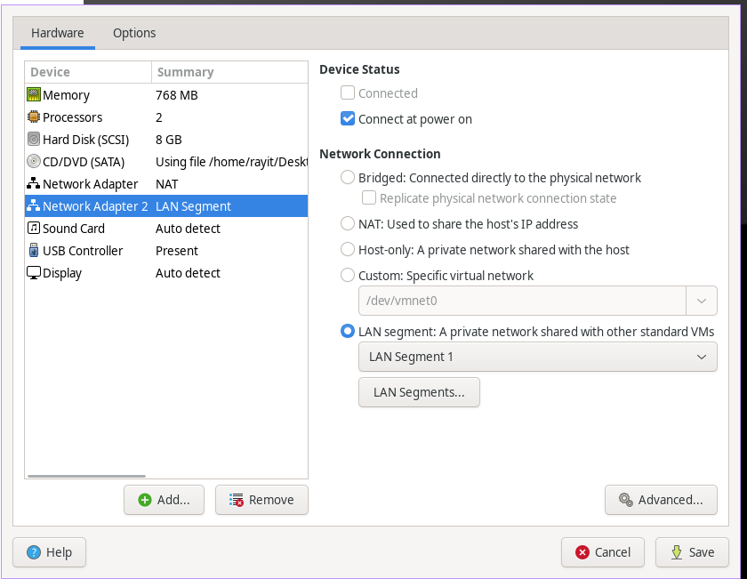

# DevOps – VyOS Router Setup

## Downloaden

Download ISO bestand:  
https://vyos.net/get/nightly-builds/

---

## Netwerk adapters instellen

- Voeg een 2e netwerkkaart toe aan je VyOS router:
  - Adapter 1: NAT
  - Adapter 2: LAN segment
- Verbind alle andere DevOps machines met het LAN segment




---

## VyOS installeren

1. Start VyOS vanaf de virtuele cd-rom
2. Login met:
   - Gebruiker: vyos  
   - Wachtwoord: vyos
3. Installeer VyOS op de virtuele harde schijf

```bash
install image
```

---

## VyOS instellen als router

Ga naar configuratiemodus:

```bash
configure
```

### WAN interface (DHCP)

```bash
set interfaces ethernet eth0 address dhcp
```

### LAN interface (Static IP)

```bash
set interfaces ethernet eth1 address 10.0.0.5/24
```

---

## NAT en masquerade

```bash
set nat source rule 100 outbound-interface name eth0
set nat source rule 100 source address 10.0.0.0/24
set nat source rule 100 translation address masquerade
```

---

## DNS forwarding instellen

```bash
set service dns forwarding listen-address 10.0.0.5
set service dns forwarding allow-from 10.0.0.0/24
set service dns forwarding name-server 8.8.8.8
```

Alternatief (bijv. Eduroam):

```bash
set service dns forwarding name-server 10.200.80.1
```

---

## Configuratie opslaan

```bash
commit
save
exit
```

---

## Klaar 🎉

Je hebt VyOS omgetoverd tot een échte router – NAT, DNS en alles werkt!

Je bent nu officieel een netwerkbeheerder in wording.

### Volgende stappen

- Firewalls
- DHCP
- VPN
- Eigen datacenter 😉

> "If it works and you configured it yourself… that’s not magic – that’s skills."
